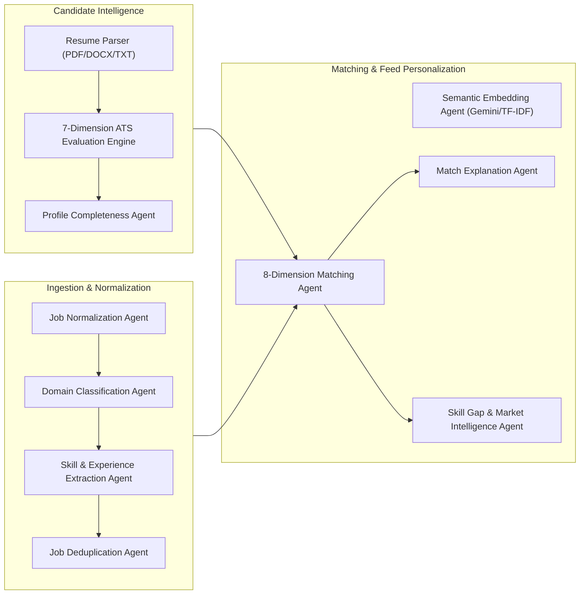

# Autonomous AI & ML Agents Architecture

> **Modular, specialized intelligence agents operating across resume parsing, opportunity classification, deterministic matching, and market analytics.**

---

## 1. Agent Ecosystem Overview

---

## 2. Agent Catalog & Specifications

### 2.1 Job Normalization Agent (`job_normalization_agent.py`)
- **Responsibility:** Cleans noisy input titles, detects remote/hybrid/onsite signals, and canonicalizes skill aliases.
- **Rules & Heuristics:**
  - Standardizes variations like `"React.js"` or `"ReactJS"` $\rightarrow$ `"React"`.
  - Normalizes work mode based on keywords (`"wfh"`, `"work from home"`, `"remote"`, `"hybrid"`).
  - Trims recruitment promotional noise (e.g. `"Urgently Hiring!!!"`, `"Sign on Bonus!"`).

### 2.2 Domain Classification Agent (`job_classification_agent.py`)
- **Responsibility:** Categorizes roles across 20+ specialized technical domains.
- **Taxonomy:**
  - Machine Learning & Deep Learning
  - Artificial Intelligence & LLMs
  - Data Science & Analytics
  - Full Stack Engineering
  - Frontend Development
  - Backend Development
  - Cloud Architecture & DevOps
  - Cybersecurity & Information Security
  - Mobile App Development (iOS/Android/Flutter)
  - Embedded Systems & IoT
  - Quality Assurance & SDET
  - Product & Technical Management
  - UI/UX & Design Systems
  - Blockchain & Web3
- **Algorithm:** Weighted keyword frequency scoring with high-performance regex caching.

### 2.3 Skill & Experience Extraction Agent (`skill_extraction_agent.py`)
- **Responsibility:** Extracts required vs. preferred skill lists, experience bounds, and fresher eligibility.
- **Fresher Eligibility Heuristics:**
  - Matches phrases: `"fresher"`, `"fresh graduate"`, `"entry level"`, `"0-1 years"`, `"internship"`, `"no experience required"`, `"graduates of 2024/2025/2026"`.
  - Parses numerical bounds: `"2 to 4 years"` $\rightarrow$ `[2.0, 4.0]`.

### 2.4 Resume Parsing Engine (`parser.py`)
- **Multi-Format Ingestion:**
  - **PDF:** Powered by `pymupdf` with sequential block extraction.
  - **DOCX:** Structured paragraph parsing via `python-docx`.
  - **TXT:** UTF-8 normalized text processing.
- **Section Boundary Detection:** Uses regex state machine to identify `Education`, `Experience`, `Projects`, `Skills`, `Certifications`, and `Achievements`.
- **Contact Extraction:** Sanitized regex extraction for emails, phone numbers, LinkedIn URLs, and GitHub profiles.

### 2.5 7-Dimension ATS Evaluation Engine (`ats_engine.py`)
Scores resumes on a scale of 0 to 100 based on standard Applicant Tracking System heuristics:
1. **Keyword Density & Breadth (25%):** Count and diversity of canonical technical skills.
2. **Role Relevance (15%):** Presence of target title in summary and experience descriptions.
3. **Section Architecture (15%):** Presence of essential standard headers (Education, Experience, Skills, Projects).
4. **Action & Achievements (15%):** Quantifiable results (percentages, metrics, dollar amounts, scale).
5. **Project Depth (10%):** Practical project descriptions with technology stack context.
6. **Formatting Cleanliness (10%):** Absence of multi-column tables, excessive graphics, or complex glyphs.
7. **Contact Completeness (10%):** Professional email, phone, location, and verified portfolio links.

### 2.6 Skill Gap & Market Intelligence Agent (`skill_gap_agent.py`)
- **Responsibility:** Analyzes all matching target opportunities in real-time to surface recurring missing skills.
- **Output:**
  - Skill name and category.
  - Frequency across target opportunities (% of target roles requiring it).
  - Impact level: **High** (> 60% frequency), **Medium** (30-60%), **Low** (< 30%).
  - Actionable recommendation on what projects to build.
