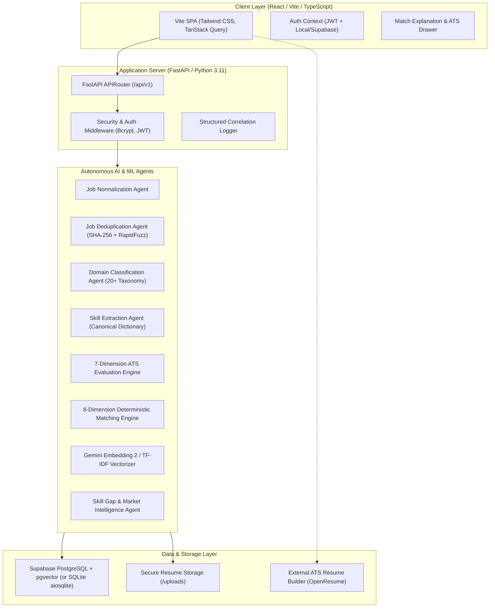
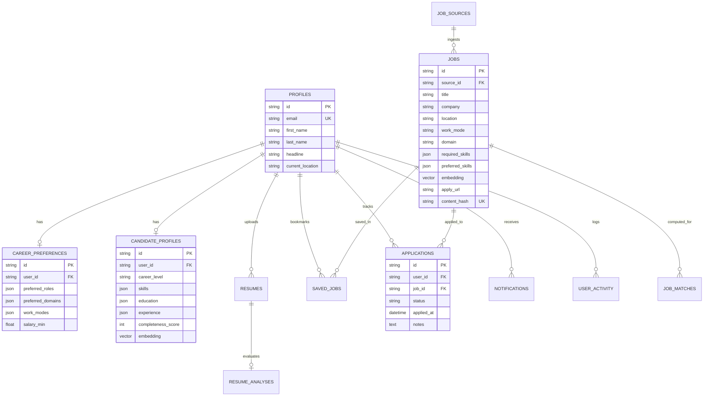

# ZyncRole AI - System Architecture & Engineering Design

> **"One Resume. Every Opportunity. One Intelligent Career Feed."**

---

## 1. High-Level System Architecture

---

## 2. Architectural Principles & Zero-Cost Operation

1. **Lightweight & Free Tier Optimized:**
   - **Backend:** FastAPI async coroutines running on standard Python 3.11 with zero memory-bloated runtime dependencies.
   - **Database:** Supabase Free Tier (PostgreSQL 15 with pgvector extension) with automatic zero-config local SQLite fallback for offline demo execution.
   - **AI/ML:** Local deterministic algorithms (TF-IDF + Cosine similarity, RapidFuzz token matching, Regex heuristic parsing) combined with free-tier Google Gemini 2.0 Flash / text-embedding-004.
   - **External ATS Builder:** Configured to direct users to OpenResume without hosting an unmaintainable PDF canvas engine.

2. **No Admin Interface (Hard Product Boundary):**
   - In accordance with core system constraints, ZyncRole AI contains **no administrative portals, no admin login routes, and no privileged operator tables**.
   - Platform administration is handled autonomously via scheduled ingestion workers and secure environment credentials.

3. **Pluggable Ingestion Pipeline:**
   - Every job source adheres to `BaseSourceAdapter`.
   - Free/open adapters (Remotive, Adzuna, The Muse, Greenhouse, Lever, Ashby, Generic Feeds) are active.
   - Gated or proprietary sources (LinkedIn, Indeed, Naukri, Internshala) operate via official/partner APIs and are gracefully disabled unless valid partner credentials are provided. **No unauthorized scraping is executed.**

---

## 3. Database Entity Relationship Model

---

## 4. End-to-End User Journey

1. **Discovery & Onboarding:**
   - User registers or clicks **1-Click Instant Demo Evaluation**.
   - Completes 4 calm, intuitive onboarding steps: Education, Career Interests, Preferences, and Skills.
   - Profile Agent synthesizes candidate intelligence and computes readiness percentage.

2. **Resume Intelligence & ATS Evaluation:**
   - User uploads resume (PDF, DOCX, or TXT).
   - PyMuPDF / python-docx extracts raw structured text and detects contact details, projects, education, and skills.
   - ATS Engine benchmarks resume across 7 dimensions (Keywords, Role Relevance, Formatting, Achievements, Sections, Projects, Contact info) outputting actionable strengths and weaknesses.
   - One-click CTA links to OpenResume to rebuild in ATS-compliant format.

3. **Autonomous Career Feed & Matching:**
   - 8-Dimension Deterministic Engine benchmarks user against all ingested, deduplicated opportunities.
   - Match Score Drawer reveals exact mathematical breakdown and explains *why* the candidate fits and *how to improve*.
   - User bookmarks roles or clicks "Apply", which opens authentic employer posting and logs progress in the Application Pipeline.
