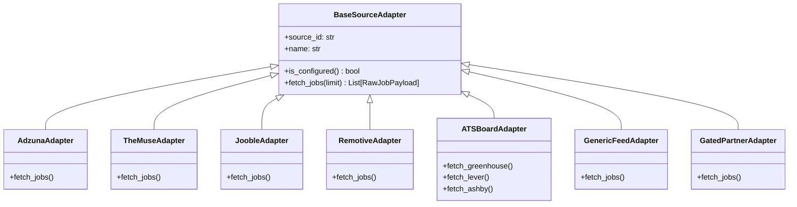
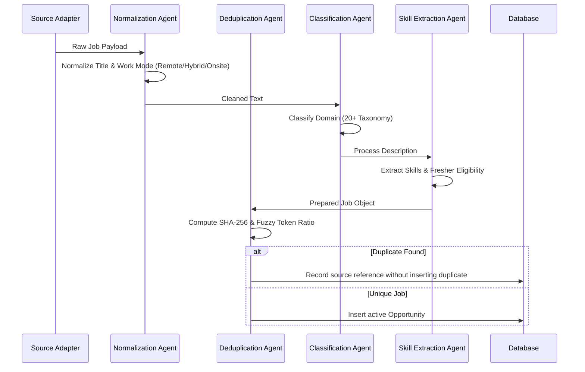

# Job Ingestion Architecture & Source Adapters

> **Ethical, normalized, and resilient multi-source opportunity ingestion.**

---

## 1. Core Principles & Ethical Stance

1. **Zero Unauthorized Scraping:**
   - ZyncRole AI does **not** employ headful browser scraping, bypass anti-bot protections, or violate Terms of Service of closed job boards.
   - All external data ingestion utilizes official public REST endpoints, open RSS/JSON feeds, public ATS boards, or developer partner APIs.

2. **Gated Source Policy:**
   - Adapters for closed platforms (LinkedIn, Indeed, Naukri, Internshala) are architectural stubs requiring explicit API partner credentials.
   - If credentials are not present in `.env`, the adapter remains cleanly inactive without throwing runtime exceptions or blocking system execution.

3. **Authentic Source Attribution:**
   - Every opportunity permanently retains its originating `source_id`, `source_url`, and `apply_url`.
   - The user application redirect points directly to the authentic employer listing.

---

## 2. Source Adapter Registry

All adapters extend the `BaseSourceAdapter` abstract class located in `backend/app/ingestion/base.py`:

### Supported Source Adapters

| Adapter | Type | Auth Required? | Free Tier Limits | Status |
|:---|:---:|:---:|:---|:---:|
| **Greenhouse Public ATS** | Direct ATS API | No | Unlimited public boards | Enabled |
| **Lever Public ATS** | Direct ATS API | No | Unlimited public boards | Enabled |
| **Ashby Public ATS** | Direct ATS API | No | Unlimited public boards | Enabled |
| **Remotive** | Public Tech API | Optional | Free open feed available | Enabled |
| **The Muse** | REST API | Optional | Free key (500 req/hr) | Enabled |
| **Adzuna** | REST API | Yes | Free developer account (250 req/day) | Configurable |
| **Jooble** | REST API | Yes | Free API key | Configurable |
| **Generic RSS/JSON** | Syndicate Feed | No | Dependent on feed | Enabled |
| **LinkedIn / Indeed** | Gated Partner | Yes | Enterprise API credentials | Gated (Disabled by default) |
| **Naukri / Internshala**| Gated Partner | Yes | Enterprise API credentials | Gated (Disabled by default) |

---

## 3. Normalization Pipeline

When raw job payloads are ingested:

---

## 4. Deduplication Strategy

Job postings across multiple aggregators frequently duplicate the same underlying opening. ZyncRole AI implements a **two-tier deduplication algorithm**:

1. **Exact Deterministic Fingerprint (L1):**
   - Normalizes company name (strips `Inc`, `Corp`, `LLC`, `Technologies`, punctuation).
   - Normalizes job title (expands `Sr.` $\rightarrow$ `Senior`, `Dev` $\rightarrow$ `Developer`).
   - Normalizes city/state.
   - Computes:
     $$\text{Hash} = \text{SHA256}(\text{norm\_company} + \text{norm\_title} + \text{norm\_location})$$
2. **Fuzzy RapidFuzz Token Set Ratio (L2):**
   - For jobs in the same region, calculates `token_set_ratio` on company name and title.
   - Postings with $> 90\%$ similarity within a 14-day window are linked to the primary job record under `duplicate_sources`, preventing feed clutter.
